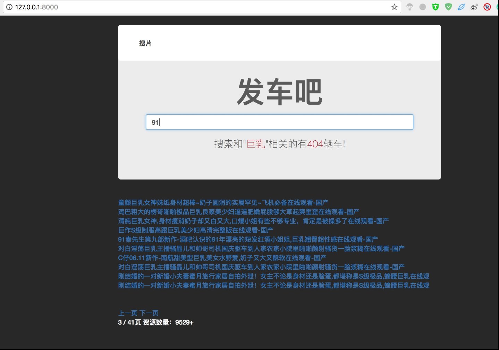
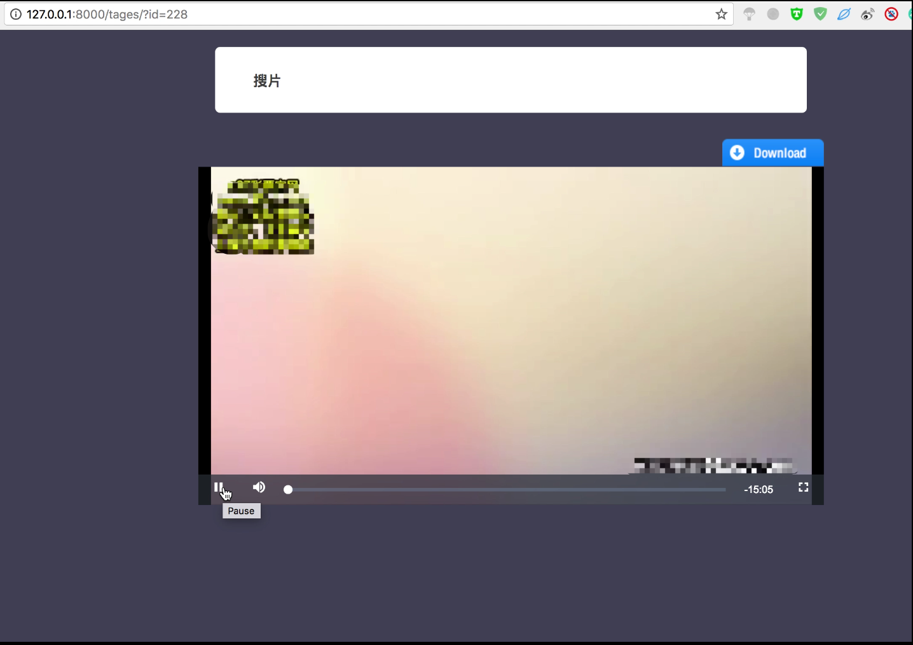

#项目文档
##1.项目说明
>###非常感谢大家可以欣赏Django_fc_hs这个项目，这个项目的本身非常的简单，没有什么技术难度，主要的功能也是很简单的就是直接取出数据库的视频地址进行播放，当然也是可以进行搜索功能的。


##2.所需要的环境与组件
>主要用到环境：Python3.6, Django1.11.7,Pymysql,Mysql数据库

##3.项目目录介绍
>huang_se --> 项目目录     

>huangse --> App目录

>migrations --> 数据库脚本生成目录

>paurl --->爬虫所在目录

>static -->静态文件目录

>templates -->模板文件目录

>huangsedb.sql --> sql数据

##3.安装
>1.下载项目后进入项目目录```cd Django_fc_hs/huang_se```<br/>
>
>2.如果阁下没有安装上面我所说到的环境，请阁下自行安装。<br/>
>
>3.安装环境后请修改```Django_fc_hs/huang_se/huang_se/```目录下的```settings.py```文件里面的```DATABASES ```数据库连接信息<br/>
>
>4.然后请阁下新建数据库```huangseDB```编码为```UTF-8```把```Django_fc_hs```目录下的```huangsedb.sql```文件导入数据库<br/>
>


##4.运行
>5.然后请阁下执行```python manage.py runserver```<br/>
>
>6.然后访问```http://127.0.0.0:8000```<br/>
>

##5.项目效果图
<br/>
<br/>
<br/>
###项目部提供后期更新，有兴趣的小伙伴可以拿去玩玩